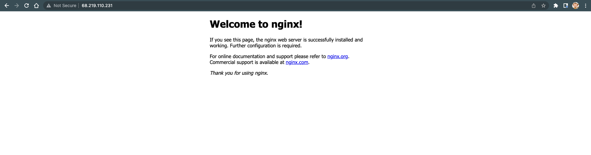

## Using Azure cloud implement the following.


Requirements
Create a virtual machine.
Create a public IP address.
Run shell script to install NGINX on the virtual machine.
Create SSH key / Use SSH key to connect to the virtual machine.

----------------------------------------------------------------

   


```
ssh -i ~/.ssh/linuxkey.pem linuxusr@68.219.110.231
```

```

Terraform used the selected providers to generate the following execution plan. Resource actions are indicated with the following symbols:
  + create

Terraform will perform the following actions:

  # azurerm_linux_virtual_machine.linux_vm will be created
  + resource "azurerm_linux_virtual_machine" "linux_vm" {
      + admin_username                  = "linuxusr"
      + allow_extension_operations      = true
      + computer_name                   = (known after apply)
      + custom_data                     = (sensitive value)
      + disable_password_authentication = true
      + extensions_time_budget          = "PT1H30M"
      + id                              = (known after apply)
      + location                        = "northeurope"
      + max_bid_price                   = -1
      + name                            = "linuxvm"
      + network_interface_ids           = (known after apply)
      + patch_mode                      = "ImageDefault"
      + platform_fault_domain           = -1
      + priority                        = "Regular"
      + private_ip_address              = (known after apply)
      + private_ip_addresses            = (known after apply)
      + provision_vm_agent              = true
      + public_ip_address               = (known after apply)
      + public_ip_addresses             = (known after apply)
      + resource_group_name             = "app-grp"
      + size                            = "Standard_D2s_v3"
      + virtual_machine_id              = (known after apply)
      + zone                            = (known after apply)

      + admin_ssh_key {
          + public_key = (known after apply)
          + username   = "linuxusr"
        }

      + os_disk {
          + caching                   = "ReadWrite"
          + disk_size_gb              = (known after apply)
          + name                      = (known after apply)
          + storage_account_type      = "Standard_LRS"
          + write_accelerator_enabled = false
        }

      + source_image_reference {
          + offer     = "UbuntuServer"
          + publisher = "Canonical"
          + sku       = "18.04-LTS"
          + version   = "latest"
        }
    }

  # azurerm_network_interface.nginx-nic will be created
  + resource "azurerm_network_interface" "nginx-nic" {
      + applied_dns_servers           = (known after apply)
      + dns_servers                   = (known after apply)
      + enable_accelerated_networking = false
      + enable_ip_forwarding          = false
      + id                            = (known after apply)
      + internal_dns_name_label       = (known after apply)
      + internal_domain_name_suffix   = (known after apply)
      + location                      = "northeurope"
      + mac_address                   = (known after apply)
      + name                          = "nginx-if-nic"
      + private_ip_address            = (known after apply)
      + private_ip_addresses          = (known after apply)
      + resource_group_name           = "app-grp"
      + virtual_machine_id            = (known after apply)

      + ip_configuration {
          + gateway_load_balancer_frontend_ip_configuration_id = (known after apply)
          + name                                               = "internal"
          + primary                                            = (known after apply)
          + private_ip_address                                 = (known after apply)
          + private_ip_address_allocation                      = "dynamic"
          + private_ip_address_version                         = "IPv4"
          + public_ip_address_id                               = (known after apply)
          + subnet_id                                          = (known after apply)
        }
    }

  # azurerm_network_security_group.nginx-vm-nsg will be created
  + resource "azurerm_network_security_group" "nginx-vm-nsg" {
      + id                  = (known after apply)
      + location            = "northeurope"
      + name                = "nginx-nsg"
      + resource_group_name = "app-grp"
      + security_rule       = [
          + {
              + access                                     = "Allow"
              + description                                = "Allow HTTP"
              + destination_address_prefix                 = "*"
              + destination_address_prefixes               = []
              + destination_application_security_group_ids = []
              + destination_port_range                     = "80"
              + destination_port_ranges                    = []
              + direction                                  = "Inbound"
              + name                                       = "Allow-HTTP"
              + priority                                   = 110
              + protocol                                   = "Tcp"
              + source_address_prefix                      = "Internet"
              + source_address_prefixes                    = []
              + source_application_security_group_ids      = []
              + source_port_range                          = "*"
              + source_port_ranges                         = []
            },
          + {
              + access                                     = "Allow"
              + description                                = "Allow SSH"
              + destination_address_prefix                 = "*"
              + destination_address_prefixes               = []
              + destination_application_security_group_ids = []
              + destination_port_range                     = "22"
              + destination_port_ranges                    = []
              + direction                                  = "Inbound"
              + name                                       = "Allow-SSH"
              + priority                                   = 100
              + protocol                                   = "Tcp"
              + source_address_prefix                      = "Internet"
              + source_address_prefixes                    = []
              + source_application_security_group_ids      = []
              + source_port_range                          = "*"
              + source_port_ranges                         = []
            },
        ]
    }

  # azurerm_public_ip.nginx-vm-ip will be created
  + resource "azurerm_public_ip" "nginx-vm-ip" {
      + allocation_method       = "Static"
      + availability_zone       = (known after apply)
      + fqdn                    = (known after apply)
      + id                      = (known after apply)
      + idle_timeout_in_minutes = 4
      + ip_address              = (known after apply)
      + ip_version              = "IPv4"
      + location                = "northeurope"
      + name                    = "nginx-pub-ip"
      + resource_group_name     = "app-grp"
      + sku                     = "Basic"
      + sku_tier                = "Regional"
      + zones                   = (known after apply)
    }

  # azurerm_resource_group.network-rg will be created
  + resource "azurerm_resource_group" "network-rg" {
      + id       = (known after apply)
      + location = "northeurope"
      + name     = "app-grp"
    }

  # azurerm_subnet.vm-subnet will be created
  + resource "azurerm_subnet" "vm-subnet" {
      + address_prefix                                 = (known after apply)
      + address_prefixes                               = [
          + "10.0.1.0/24",
        ]
      + enforce_private_link_endpoint_network_policies = false
      + enforce_private_link_service_network_policies  = false
      + id                                             = (known after apply)
      + name                                           = "app-vm-subnet"
      + resource_group_name                            = "app-grp"
      + virtual_network_name                           = "app-network-vnet"
    }

  # azurerm_subnet_network_security_group_association.nginx-vm-nsg-association will be created
  + resource "azurerm_subnet_network_security_group_association" "nginx-vm-nsg-association" {
      + id                        = (known after apply)
      + network_security_group_id = (known after apply)
      + subnet_id                 = (known after apply)
    }

  # azurerm_virtual_network.network-vnet will be created
  + resource "azurerm_virtual_network" "network-vnet" {
      + address_space         = [
          + "10.0.0.0/16",
        ]
      + dns_servers           = (known after apply)
      + guid                  = (known after apply)
      + id                    = (known after apply)
      + location              = "northeurope"
      + name                  = "app-network-vnet"
      + resource_group_name   = "app-grp"
      + subnet                = (known after apply)
      + vm_protection_enabled = false
    }

  # local_file.linuxkey will be created
  + resource "local_file" "linuxkey" {
      + content              = (sensitive)
      + directory_permission = "0777"
      + file_permission      = "0777"
      + filename             = "linuxkey.pem"
      + id                   = (known after apply)
    }

  # tls_private_key.linux_key will be created
  + resource "tls_private_key" "linux_key" {
      + algorithm                     = "RSA"
      + ecdsa_curve                   = "P224"
      + id                            = (known after apply)
      + private_key_openssh           = (sensitive value)
      + private_key_pem               = (sensitive value)
      + private_key_pem_pkcs8         = (sensitive value)
      + public_key_fingerprint_md5    = (known after apply)
      + public_key_fingerprint_sha256 = (known after apply)
      + public_key_openssh            = (known after apply)
      + public_key_pem                = (known after apply)
      + rsa_bits                      = 4096
    }

Plan: 10 to add, 0 to change, 0 to destroy.yes
```
